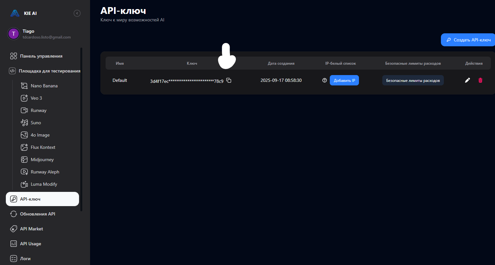
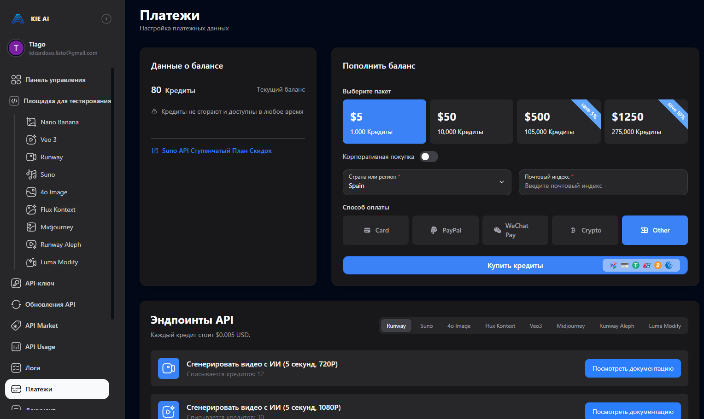
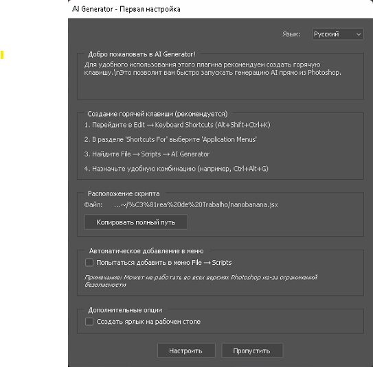

# 🚀 Step-by-Step Guide: Getting Your NanoBanana API Key and Setting Up the Photoshop Script

## Why You Need This
The Photoshop script connects to NanoBanana's AI models (like Nano-Banana / Flux Kontext). To do this, it needs permission to talk to NanoBanana's servers. That permission is granted through an **API key** — a long secret code that works like a password. 

👉 Without this key, the script cannot run AI models inside Photoshop.

## 1. Create or Log In to a NanoBanana Account

1. Open **https://nanobananaapi.ai/** in your browser.
2. Click **"Explore Features"** or **"Start"** button.
3. You'll see a login modal with two options:
   - **Google Account**: Click the Google button to sign in with your Gmail
   - **Microsoft Account**: Click **"Sign in with Microsoft"**

4. Complete the verification process:
   - You'll see a CAPTCHA verification with **"I am human"**
   - Check the box to verify you're human

✅ After logging in, you'll be redirected to your NanoBanana dashboard.

## 2. Navigate to API Keys Section

1. Once logged in, you'll see the main dashboard.
2. In the left sidebar, click on **"API Keys"** section.

3. You'll see your API key management page with:
   - Your existing API key (partially hidden for security)
   - Creation date
   - Options to manage your key

## 3. Get Your API Key

1. In the API Keys section, you'll see a key labeled **"Default"**.
2. Click the **copy button** next to your API key to copy it to clipboard.
   - ⚠️ This is secret — never share it publicly. Treat it like your password.
3. Keep this key safe - you'll need it for the Photoshop script.

## 4. Check Your Credits (Optional Top-up)

💡 **Good news!** Your account comes with **50 free credits** already topped up for testing purposes.

1. Click on **"Payments"** in the left sidebar.

2. You'll see:
   - **Current balance**: Your available credits
   - **Credit packages available**: 1,000, 10,000, 105,000, and 275,000 credits
   - **Pricing**: Starting from basic packages

3. **For testing**: The existing 50 free credits are perfect to start with (approximately 12-13 requests).
4. **For extended use**: The most basic top-up package (1,000 credits) will give you approximately 250 requests and is very affordable.

## 5. Install the Photoshop Script

1. Download the `.jsx` file provided.
2. Copy it into your Photoshop Scripts folder:
   - **Windows**: `C:\Program Files\Adobe\Adobe Photoshop <version>\Presets\Scripts`
   - **Mac**: `/Applications/Adobe Photoshop <version>/Presets/Scripts`
3. Restart Photoshop.
   - After restart, the script will appear under **File → Scripts**.

## 6. Connect the Script to NanoBanana API

1. In Photoshop, run the script (**File → Scripts → NanoBanana**).

2. When you see the **"API Key Required"** dialog:
   - Paste the API key you copied from the NanoBanana dashboard
   - Click **"OK"** to save

3. The script will remember your key for future use.

## 7. Configure the Script

1. In the **NanoBanana v1.0** interface:
   - **Model**: Select "NanoBanana" from the dropdown
   - **Language**: Choose "Russian" or your preferred language
   - **Prompt**: Enter your image generation prompt
   - **References**: Choose "Browse..." if you want to upload reference images
   - Configure other settings as needed

2. Click **"Generate"** to create your image!

## 8. Advanced Configuration (Optional)

If you need advanced settings:
1. Access **"AI Generator - Initial Setup"**
2. Configure:
   - **Hotkey combinations** (Ctrl+Shift+Ctrl+H)
   - **Scripts location** and file paths
   - **Automatic menu addition**
   - **Additional script options**

## Available API Endpoints

Your account has access to these API endpoints:
- **"Create image from text"** - 4 credits per request
- **"Get Nano Banana task details"** - 0 credits

## ⚠️ Troubleshooting

* **Can't find your API key?** Go back to NanoBanana dashboard → API Keys section
* **Low on credits?** Check the Payments section to top up
* **Script not showing in Photoshop?** Make sure you copied the `.jsx` into the correct folder *and restarted Photoshop*
* **Authentication issues?** Try logging out and back in to NanoBanana

## 💡 Pro Tips

- **Start with free credits**: Use your included 50 free credits to test the system
- **Most economical option**: The 1,000 credit package gives you ~250 generations
- **Save your prompts**: Keep track of prompts that work well for future use
- **Monitor usage**: Check your credit balance regularly in the Payments section

You're now ready to generate amazing AI images directly inside Photoshop! 🎉